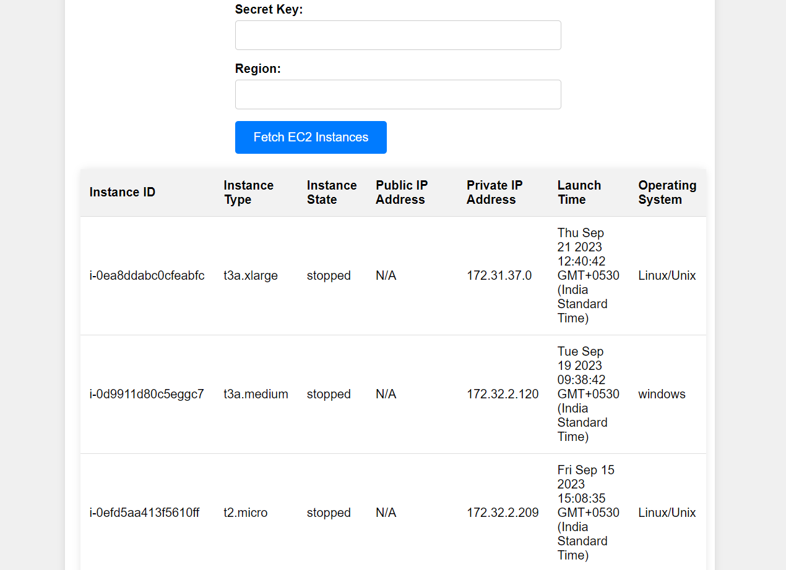
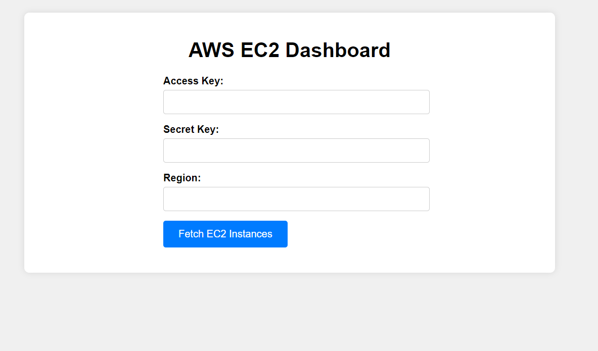

# AWS EC2 Dashboard

This is a simple web-based dashboard that allows you to fetch and display information about your Amazon Web Services (AWS) Elastic Compute Cloud (EC2) instances. You can use this dashboard to retrieve EC2 instance details by providing your AWS access key, secret key, and the AWS region.

## Prerequisites

Before you can use this dashboard, you need to have the following prerequisites in place:

- An AWS account.
- AWS Access Key and Secret Key for authentication.

## Getting Started

To get started with the AWS EC2 Dashboard, follow these steps:

1. Clone this repository to your local machine or download the project files.

2. Open the `index.html` file in a web browser.

3. Fill out the form on the web page with the following information:
   - **Access Key:** Your AWS Access Key.
   - **Secret Key:** Your AWS Secret Key.
   - **Region:** The AWS region where your EC2 instances are located (e.g., `ap-south-1`).

4. Click the "Fetch EC2 Instances" button to retrieve the EC2 instance details for the specified region.

**Note:** Make sure to keep your AWS Access Key and Secret Key secure, and do not share them publicly. It is recommended to use IAM roles and policies for better security practices in a production environment.

## Features

- **Authentication:** The dashboard uses your AWS Access Key and Secret Key to authenticate with AWS services.

- **Region Selection:** You can specify the AWS region to fetch EC2 instance information from.

- **Display:** The dashboard displays information about your EC2 instances, including Instance ID, Instance Type, Instance State, Public IP Address, Private IP Address, Launch Time, and Operating System.

## Screenshots

## Styling

The dashboard is styled using CSS to provide a clean and user-friendly interface.

## AWS SDK

This dashboard utilizes the AWS SDK for JavaScript to interact with AWS services. The SDK is included in the HTML file via a CDN.

## Contributing

If you'd like to contribute to this project or have suggestions for improvements, please feel free to submit a pull request or open an issue on the GitHub repository.

## License

This project is licensed under the MIT License. This means that you are free to use, modify, and distribute the code for any purpose, including commercial use. See the [LICENSE](LICENSE) file for details.

## Made with love by Hari Om

I created this extension to help people save and manage their favorite links. I hope you find it useful!
